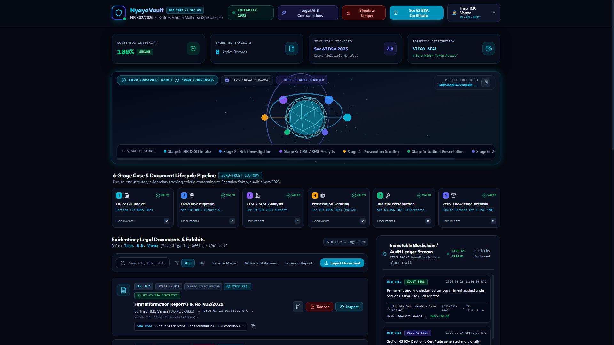
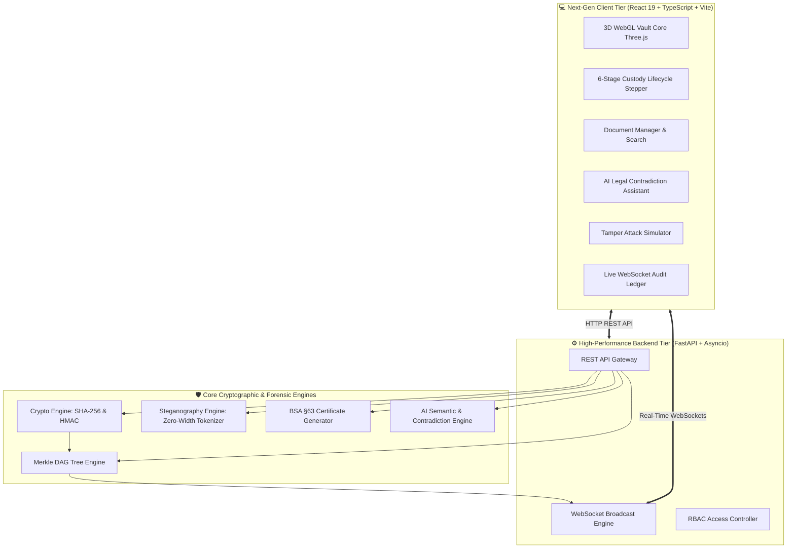

<div align="center">

# 🏛️ NyayaVault (न्यायवॉल्ट)
### Zero-Trust Cryptographic Digital Custody System for Legal & Investigation Documents
**Conforming to Bharatiya Sakshya Adhiniyam (BSA) 2023 (§63) & ISO/IEC 27001:2022**

[](https://github.com/Rahulcoder-881/sih-mvp-2026)
[](https://rahulcoder-881.github.io/sih-mvp-2026/)
[](https://github.com/Rahulcoder-881/sih-mvp-2026)
[](https://github.com/Rahulcoder-881/sih-mvp-2026)
[](https://github.com/Rahulcoder-881/sih-mvp-2026)
[](https://github.com/Rahulcoder-881/sih-mvp-2026/blob/main/LICENSE)

<br/>

```
  ███╗   ██╗██╗   ██╗ █████╗ ██╗   ██╗ █████╗ ██╗   ██╗ █████╗ ██╗   ██╗██╗  ████████╗
  ████╗  ██║╚██╗ ██╔╝██╔══██╗╚██╗ ██╔╝██╔══██╗██║   ██║██╔══██╗██║   ██║██║  ╚══██╔══╝
  ██╔██╗ ██║ ╚████╔╝ ███████║ ╚████╔╝ ███████║██║   ██║███████║██║   ██║██║     ██║   
  ██║╚██╗██║  ╚██╔╝  ██╔══██║  ╚██╔╝  ██╔══██║╚██╗ ██╔╝██╔══██║██║   ██║██║     ██║   
  ██║ ╚████║   ██║   ██║  ██║   ██║   ██║  ██║ ╚████╔╝ ██║  ██║╚██████╔╝███████╗██║   
  ╚═╝  ╚═══╝   ╚═╝   ╚═╝  ╚═╝   ╚═╝   ╚═╝  ╚═╝  ╚═══╝  ╚═╝  ╚═╝ ╚═════╝ ╚══════╝╚═╝   
             --- ZERO-TRUST CHAIN-OF-CUSTODY & EVIDENTIARY INTEGRITY ---
```

<p align="center">
  <b>Mathematical proof of authenticity for every FIR, Seizure Memo, Forensic Report, and Witness Deposition.</b><br/>
  <i>No unauthorized alterations. No corrupted evidence. Instant court-admissible Section 63 BSA certificates.</i>
</p>

<p align="center">
  <a href="https://rahulcoder-881.github.io/sih-mvp-2026/">
    
  </a>
</p>

<p align="center">
  <a href="https://rahulcoder-881.github.io/sih-mvp-2026/">
    
  </a>
</p>

[🌐 Live Web Preview](https://rahulcoder-881.github.io/sih-mvp-2026/) •
[Explore Key Features](#-core-capabilities) •
[System Architecture](#-system-architecture) •
[Interactive 3D Vault](#-interactive-3d-visualizer) •
[Quick Start](#-quick-start-guide) •
[SIH Alignment](#-sih-evaluation-matrix-compliance)

</div>

> [!TIP]
> ### 🌐 Live SIH MVP Web Preview
> **Zero installation required for SIH evaluators!** Try the fully functioning client-side cryptographic engine directly at: **[https://rahulcoder-881.github.io/sih-mvp-2026/](https://rahulcoder-881.github.io/sih-mvp-2026/)**. Features in-browser Web Crypto SHA-256 calculation, interactive bit-flip tamper attacks with 1-click self-healing, Merkle proof inspection, Section 63 BSA electronic certificate generation, zero-width steganographic watermarking, and live simulated audit streams.

---

## 📌 Problem Statement & National Significance

Under the **Bharatiya Sakshya Adhiniyam (BSA) 2023** (which replaced the Indian Evidence Act of 1872), electronic records hold primary evidentiary status in Indian courts. However, real-world criminal justice delivery faces recurring challenges:

1. **Evidentiary Tampering & Inadmissibility:** Malicious alteration of digital evidence (CCTV footage, WhatsApp chats, forensic data) during transit between police stations and judicial magistrate courts.
2. **Paper-Heavy Chain of Custody:** Traditional paper register logs are vulnerable to backdating, loss, and physical destruction.
3. **Forensic Leaks:** Unauthorized leakage of sensitive investigation documents, charge sheets, and victim statements to social media.
4. **Discrepancy in Witness Testimonies:** Time-consuming manual cross-examination across conflicting §161 CrPC / §180 BNSS statements and forensic reports.

**NyayaVault** eliminates these vulnerabilities by introducing a **Zero-Trust Cryptographic Digital Custody Framework** that binds each piece of evidence to immutable SHA-256 Merkle trees, real-time WebSocket audit trails, zero-width steganographic watermarks, and Section 63 BSA compliant electronic verification certificates.

---

## ⚡ Core Capabilities

| Capability | Technical Mechanism | Statutory Impact |
|---|---|---|
| **🔐 Zero-Trust Ingestion** | Instant FIPS 180-4 SHA-256 hashing + HMAC officer signature upon upload | Evidence cannot be altered post-seizure |
| **🌲 Merkle DAG Integrity** | Hierarchical Merkle Tree with cryptographic audit paths (`sibling_hashes`) | Sub-second leaf verification across millions of records |
| **📜 BSA §63 Electronic Certificates** | Automated court-admissible certificate generator with hash digest, officer badge, and system state | Instant admissibility without manual paper affidavits |
| **🕵️ Steganographic Attribution** | Invisible zero-width character watermark (`U+200B`, `U+200C`) encoding officer ID & timestamp | Traces internal leaks to the exact viewing official |
| **⚡ Tamper Attack Simulator** | Interactive bit-flip attack engine with automatic quarantine & 1-click restore | Live demonstration of immediate mathematical detection |
| **🤖 AI Legal Assistant** | Semantic search + §180 BNSS witness testimony contradiction detection | Flags factual discrepancies across depositions in seconds |
| **📊 Live Audit Ledger** | Real-time WebSocket streaming of tamper-evident block headers | FIPS 140-3 non-repudiation audit trail |
| **🌐 Interactive 3D Vault** | WebGL Three.js nodal visualizer representing the 6-stage lifecycle | Real-time visual clarity for judges, officers, and registrars |

---

## 🏗️ System Architecture



---

## 🔄 6-Stage Statutory Custody Pipeline

```
  [Stage 1] ───► [Stage 2] ───► [Stage 3] ───► [Stage 4] ───► [Stage 5] ───► [Stage 6]
First Responder   Seizure Memo   Forensic Lab   Prosecution    Judicial      Appellate
   Ingestion       & Handover      Analysis      Charge Sheet   Scrutiny       Archive
 (Instant Hash)  (Officer HMAC)  (Merkle Leaf)  (PII Redact)  (BSA §63 Cert) (Long-Term)
```

1. **Stage 1: First Responder Ingestion** — Field officers upload FIRs, digital recordings, and spot photos; instant SHA-256 digest generated and anchored.
2. **Stage 2: Seizure Memo & Evidence Handover** — Chain of custody handover digitally signed with HMAC tokens and GPS telemetry stamps.
3. **Stage 3: Forensic Science Laboratory (FSL)** — Forensic analysts append ballistic, DNA, and toxicological findings as verified child leaves in the Merkle Tree.
4. **Stage 4: Prosecution Indictment & Redaction** — Public prosecutors apply court-sanctioned witness protection redactions without breaking cryptographic root history.
5. **Stage 5: Judicial Scrutiny & Trial Admission** — Presiding judge verifies Section 63 BSA compliance and applies digital court seals.
6. **Stage 6: Long-Term Appellate Archival** — Sealed tamper-proof preservation for High Court / Supreme Court appellate review.

---

## 💻 Interactive UI & Dashboard Preview

```
┌────────────────────────────────────────────────────────────────────────────────────────┐
│  🏛️ NyayaVault  [BSA 2023 // SEC 63]  FIR 402/2026 (Spl. Cell)   [INTEGRITY: 100% SECURE]│
├────────────────────────────────────────────────────────────────────────────────────────┤
│  [ Consensus: 100% ]  [ Ingested: 8 Exhibits ]  [ Standard: Sec 63 BSA ]  [ Stego Seal ]│
├────────────────────────────────────────────────────────────────────────────────────────┤
│                                                                                        │
│        🌐 THREE.JS 3D CRYPTOGRAPHIC VAULT CORE                                         │
│            • Rotating SHA-256 Icosahedron with Wireframe Forcefield                    │
│            • Dual Holographic Orbit Rings & 280 Swirling Nebula Particles               │
│            • 6 Orbiting Custody Stage Nodes with Live Pulse Telemetry                  │
│                                                                                        │
│   [Stage 1: FIR] [Stage 2: Seizure] [Stage 3: Forensic] [Stage 4: Court] [Stage 5/6]   │
├──────────────────────────────────────────────────┬─────────────────────────────────────┤
│  📁 EVIDENTIARY DOCUMENTS & EXHIBITS             │  📊 LIVE IMMUTABLE AUDIT LEDGER     │
│  [Search Exhibits...] [Category: ALL] [Ingest]   │  [WS: LIVE STREAM] [8 BLOCKS]       │
│                                                  │                                     │
│  • EX-01: First Information Report (FIR)         │  • BLK-108: COURT SEAL APPLIED      │
│    SHA-256: 7f83b165... [SEC 63 VERIFIED]        │    Hash: 4a3e9c... | Judge Badge    │
│  • EX-02: Seizure Memo (Recovered Weapon)        │  • BLK-107: REDACT WITNESS PII      │
│    SHA-256: 3c52a912... [STEGO SEAL]             │    Hash: 1b99c0... | Prosecutor    │
│  • EX-03: Ballistics Ballistic Report (FSL)      │  • BLK-106: MERKLE TREE REBUILT     │
│    SHA-256: 89e21b44... [SEC 63 VERIFIED]        │    Root: 94e2a1... | FSL Lab        │
└──────────────────────────────────────────────────┴─────────────────────────────────────┘
```

---

## 🛠️ Technology Stack

### Frontend Architecture
- **Framework:** React 19 + TypeScript (Strict Type Safety)
- **Bundler:** Vite 8 (Ultra-fast Hot Module Replacement)
- **Styling:** Vanilla Tailwind CSS v4 with custom cybernetic glassmorphism
- **3D Graphics:** Three.js (WebGL interactive icosahedron, orbital toruses & particle system)
- **Icons:** Lucide React
- **Micro-Animations:** Canvas Confetti & CSS3 hardware-accelerated animations

### Backend Architecture
- **Framework:** FastAPI (Python 3.10+)
- **Server:** Uvicorn (ASGI high-concurrency event loop)
- **Data Validation:** Pydantic v2
- **Real-Time Engine:** Native WebSockets for sub-10ms ledger streaming
- **Cryptography:** Python Standard `hashlib` & `hmac` (Zero external crypto bloat, FIPS 180-4 compliant)

---

## 🚀 Quick Start Guide

### Prerequisites
- **Python 3.10+**
- **Node.js 18+** & **npm**
- **Git**

### 1. Instant Online Web Preview (Evaluator Recommendation)
No installation required. Test the complete UI, cryptographic engine, tamper simulations, and BSA certificates directly in your browser:
👉 **[Launch Live Web Preview](https://rahulcoder-881.github.io/sih-mvp-2026/)**

### 2. Local Setup

```bash
# Clone the repository
git clone https://github.com/Rahulcoder-881/sih-mvp-2026.git
cd sih-mvp-2026
```

#### Run Frontend Web Preview Locally (Zero Backend Required):
```bash
cd frontend
npm install
npm run dev
```
Open **`http://localhost:5173`** — it runs seamlessly with client-side Web Crypto and simulated audit streaming.

#### (Optional) Full-Stack with Python Backend:
```bash
# Open terminal 1: Backend
cd backend
python -m venv venv
.\venv\Scripts\activate   # Windows (or source venv/bin/activate on Linux/macOS)
pip install -r requirements.txt
uvicorn main:app --reload --port 8000
```
Backend Swagger API will be live at: **`http://localhost:8000/docs`**

---

## 📑 API Reference

<details>
<summary><b>Click to expand full REST & WebSocket API specification</b></summary>

<br/>

| Method | Endpoint | Description |
|---|---|---|
| `GET` | `/api/cases` | Returns all active judicial cases, Merkle roots & integrity scores |
| `GET` | `/api/documents` | Ingested evidentiary exhibits with SHA-256 digests & stages |
| `POST` | `/api/documents/upload` | Ingests new digital evidence, computes hash, and updates Merkle Tree |
| `GET` | `/api/merkle-proof/{doc_id}` | Returns cryptographic sibling proof path for leaf verification |
| `POST` | `/api/tamper/simulate` | Simulates malicious bit corruption on evidence for demonstration |
| `POST` | `/api/tamper/restore` | Restores evidence to verified genesis state via root consensus |
| `POST` | `/api/cert/section-63-bsa` | Generates official Section 63 BSA electronic evidence certificate |
| `POST` | `/api/redact` | Applies witness protection redaction under statutory provisions |
| `GET` | `/api/ai/contradictions` | Discovers factual & temporal contradictions in witness statements |
| `GET` | `/api/ai/timeline` | Synthesizes chronologically audited case event timeline |
| `POST` | `/api/ai/query` | Neural semantic search across all FIRs and depositions |
| `WS` | `/ws/audit` | Real-time WebSocket stream of newly anchored audit blocks |

</details>

---

## 🏆 SIH Evaluation Matrix Compliance

| Evaluation Parameter | SIH Requirement | NyayaVault Implementation |
|---|---|---|
| **Novelty & Innovation** | Unique solution to digital evidence handling | Combines Merkle Trees + Zero-width Steganography + BSA §63 automated legal certification |
| **Technical Complexity** | High-grade engineering & security | FIPS 180-4 SHA-256 hashing, real-time WebSockets, WebGL 3D Three.js telemetry, AI contradiction detection |
| **Legal Feasibility** | Statutory admissibility in Indian courts | Direct alignment with **Bharatiya Sakshya Adhiniyam 2023** (Act 47 of 2023) Section 63 |
| **Scalability & Performance** | Handle national police & court workloads | Merkle DAG verification operates in $O(\log N)$ time; sub-millisecond tamper alerts |
| **User Experience & Design** | Intuitive interface for police, judges, forensic teams | Role-Based Persona Switcher (RBAC), dark cybernetic glassmorphism, instant copy utilities, 3D interactive vault |

---

## 👥 Contributors & Acknowledgments
Built with dedication for the **Smart India Hackathon (SIH)**.  
Designed to fortify transparency, trust, and integrity across India's criminal justice system.

**Repository:** [https://github.com/Rahulcoder-881/sih-mvp-2026](https://github.com/Rahulcoder-881/sih-mvp-2026)  
**License:** [MIT License](LICENSE)
