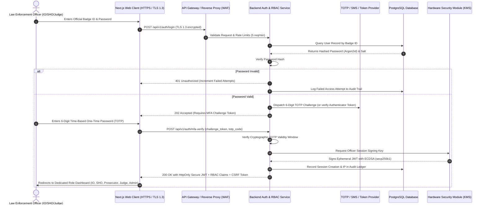
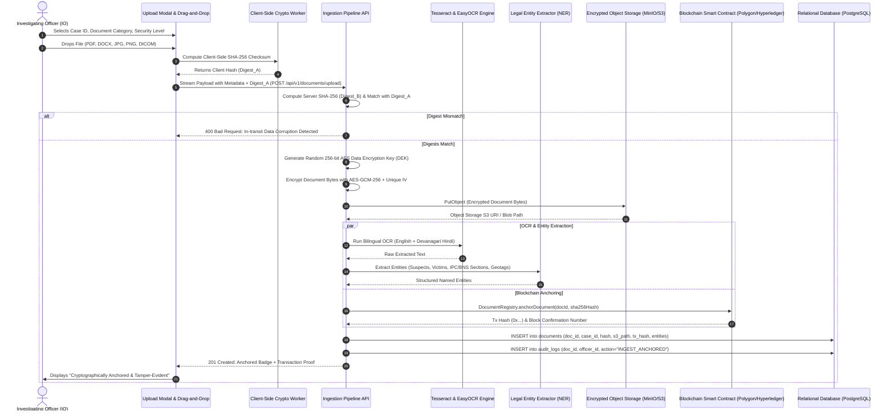
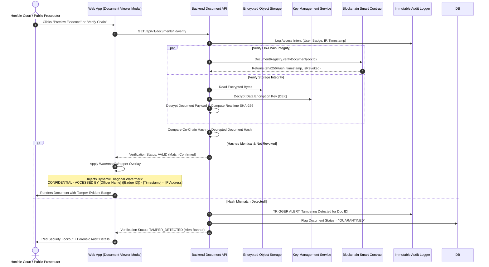
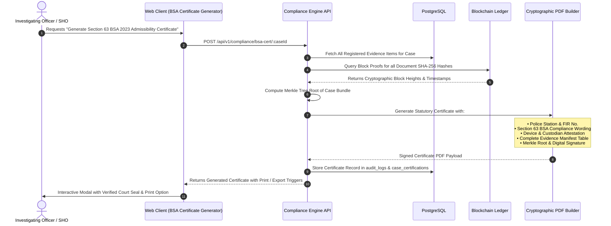
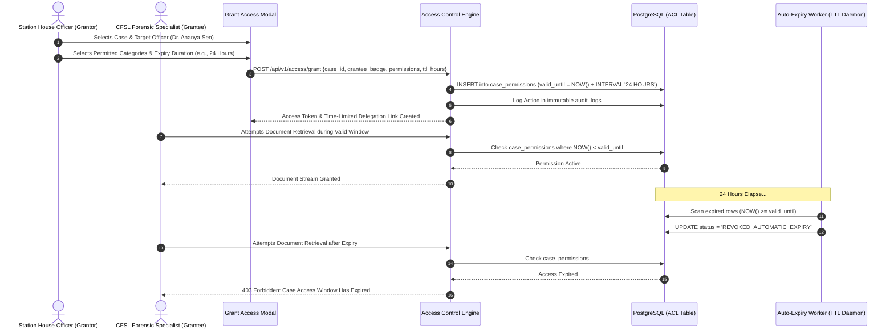

# 3. Application Flow & User Journeys (appflow.md)
**Document Ref:** MHA-NCRB/SIH-26190/AF-01  
**Classification:** Restricted Law Enforcement Technical Specification  
**Authority:** Ministry of Home Affairs | National Crime Records Bureau & Women Safety Division  

---

## 3.1 Officer Authentication Flow (MFA-Secured)

Every law enforcement officer, prosecutor, judicial authority, or system administrator accessing the Secure Digital Document Management System (DMS) must undergo a rigorous zero-trust multi-factor authentication handshake.

### Authentication State Machine
1. **Unauthenticated:** Public landing view with statutory warnings (Sec 66 IT Act & BNSS provisions).
2. **Pre-Auth:** Badge number and credential validation.
3. **MFA Challenge:** 60-second window for TOTP (Google Authenticator / Aegis / Gov SMS Gateway).
4. **Active Cryptographic Session:** 15-minute inactivity timeout, hardware key rotation, strict IP binding.

---

## 3.2 Document Ingestion, Envelope Encryption & Blockchain Anchoring Flow

When an Investigating Officer (IO) or Forensic Scientist uploads legal evidence (FIR, Panchnama, Ballistics Report, DICOM Medical Scan):

---

## 3.3 Case Document Retrieval, Dynamic Watermarking & Chain Verification Flow

When a Judicial Officer, Prosecutor, or Senior SHO reviews an evidence record:

---

## 3.4 Section 63B BSA Electronic Certificate Generation Flow

---

## 3.5 Timed Access Delegation & Permission Expiry Flow

